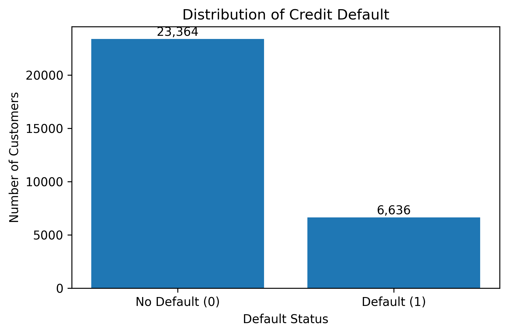
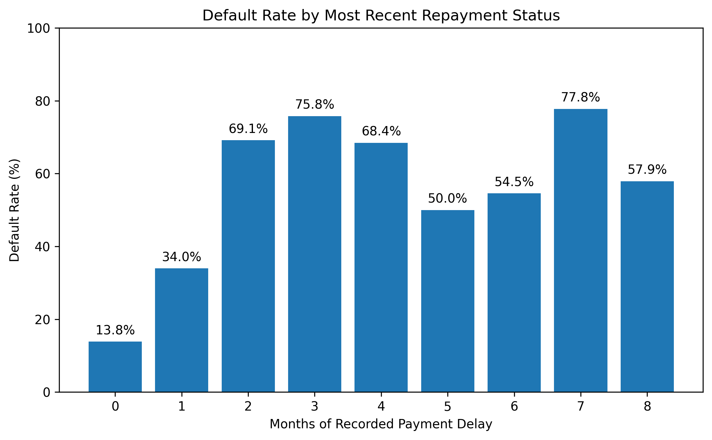
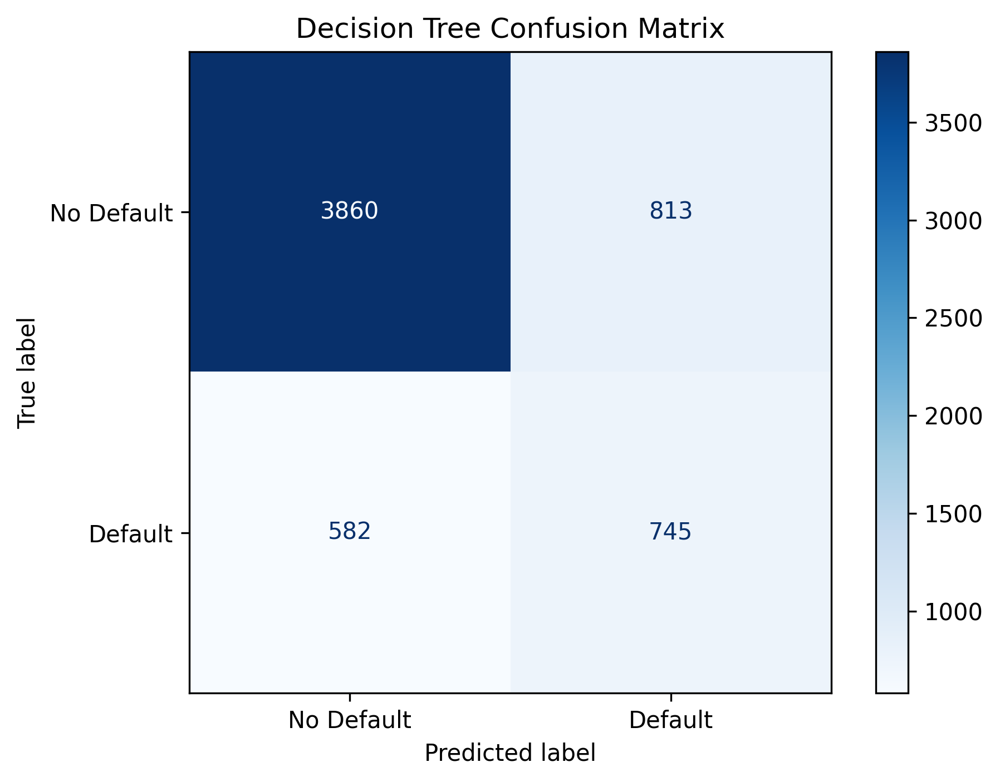
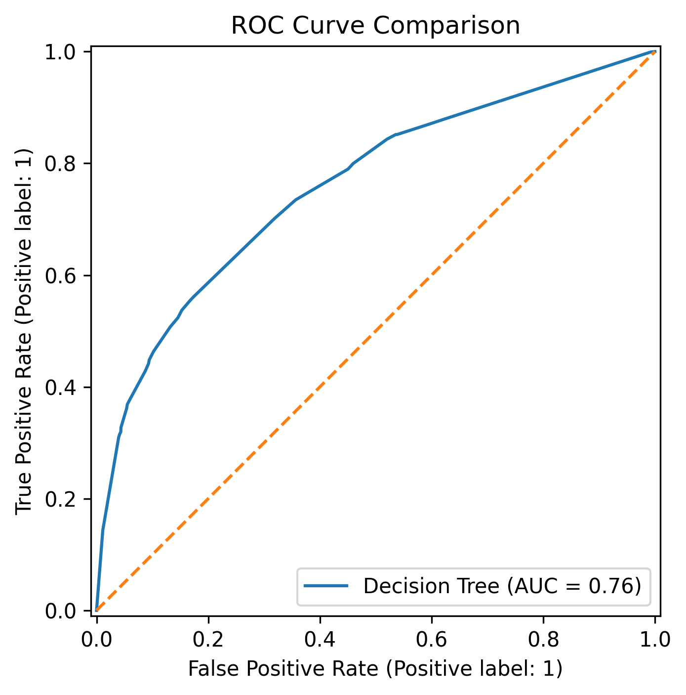
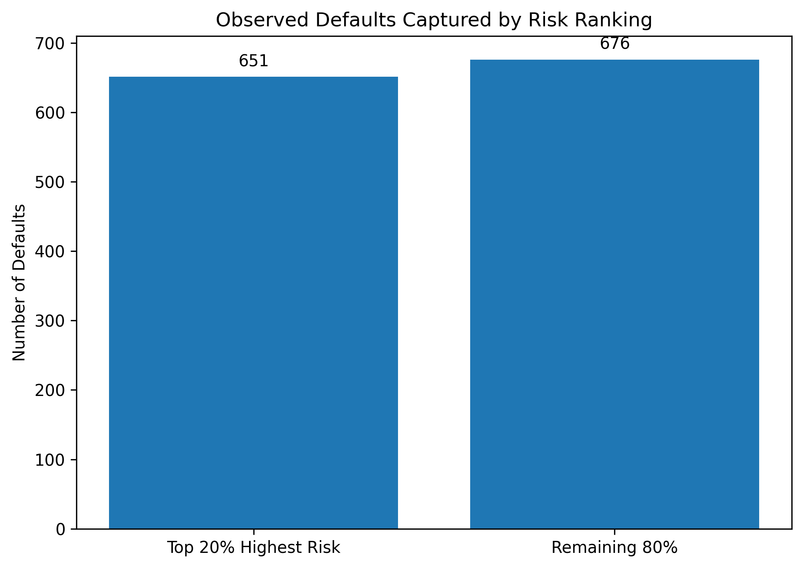

# Credit Risk Analysis & Prediction

A data analytics and machine learning project analyzing **30,000 credit card client records** to identify patterns associated with payment default, segment customer risk, and prioritize higher-risk accounts for review.

## Project Overview

Credit risk analysis helps financial institutions identify customers who may be more likely to miss future payments.

This project combines **Python, SQL, exploratory data analysis, statistical summaries, machine learning, and risk segmentation** to examine customer repayment behaviour and build a practical credit-risk prioritization workflow.

The analysis focuses not only on model performance, but also on producing interpretable business insights and a customer-level risk report that could support targeted review.

## Key Results

- Analyzed **30,000 customer records** across credit limits, repayment history, bill amounts, payment amounts, demographics, and default outcomes.
- Identified an overall default rate of **22.12%**.
- Customers with a **2-month recent repayment delay had a 69.14% default rate**, compared with **13.83%** among customers with no positive recorded delay.
- Default rate decreased from **31.79% for customers with credit limits ≤50K** to **11.17% for customers above 500K**.
- Customers who defaulted made substantially lower recent payments on average than non-defaulters.
- Compared Logistic Regression and Decision Tree models using accuracy, precision, recall, F1-score, and ROC-AUC.
- The Decision Tree achieved **75.92% ROC-AUC** and **56.14% recall**, identifying **745 of 1,327 actual defaults** in the test population.
- The **highest-risk 20% of customers captured 49.06% of all observed defaults**, representing approximately **2.45× the concentration expected through random selection**.

## Business Value

The model was used as a **risk-ranking tool**, rather than relying only on classification accuracy.

The highest-risk 20% of customers contained nearly half of all observed defaults. This type of prioritization could help an analyst or risk team focus review efforts on a smaller customer segment while identifying a disproportionately large share of higher-risk accounts.

## Dataset

This project uses the **Default of Credit Card Clients** dataset from the UCI Machine Learning Repository.

The dataset contains **30,000 credit card client records** and includes:

- Credit limits
- Demographic information
- Repayment status
- Monthly bill amounts
- Monthly payment amounts
- Default payment outcomes

Dataset documentation is available in the [`data`](data/) folder.

## Data Preparation

The analysis included:

- Dataset shape and schema validation
- Missing-value checks
- Duplicate-record checks
- Review of categorical coding
- Consolidation of undocumented education and marital-status categories into existing `Other` categories
- Review of repayment-status values
- Creation of modelling versions of repayment variables where non-positive values represented no positive recorded delay
- Removal of customer ID from predictive features
- Train/test split using stratification to preserve the default distribution

## Exploratory Analysis

### Default Distribution

The dataset is imbalanced, with **77.88% non-defaulting customers** and **22.12% defaulting customers**.



### Repayment Behaviour

Recent repayment behaviour showed a strong relationship with default.

Customers with no positive recorded delay had a **13.83% default rate**, compared with **69.14% for customers with a two-month recent delay**.



### Credit Limit Analysis

Lower-limit customers demonstrated higher observed default rates.

| Credit Limit Band | Default Rate |
|---|---:|
| ≤50K | 31.79% |
| 50K–100K | 25.80% |
| 100K–200K | 19.48% |
| 200K–500K | 14.80% |
| >500K | 11.17% |

## Machine Learning

Three approaches were evaluated:

1. Baseline classifier
2. Logistic Regression
3. Decision Tree

The baseline model demonstrates why accuracy alone is misleading for an imbalanced credit-risk dataset: predicting every customer as non-default produced **77.88% accuracy but 0% recall for actual defaults**.

### Model Comparison

| Model | Accuracy | Precision | Recall | F1 Score | ROC-AUC |
|---|---:|---:|---:|---:|---:|
| Baseline | 77.88% | 0.00% | 0.00% | 0.00% | 50.00% |
| Logistic Regression | 77.53% | 49.29% | 54.56% | 51.79% | 74.60% |
| Decision Tree | 76.75% | 47.82% | **56.14%** | 51.65% | **75.92%** |

The Decision Tree was used for the final risk-ranking analysis because it produced the strongest recall and ROC-AUC of the tested models.

### Confusion Matrix

The Decision Tree identified:

- **745 true defaults**
- **582 missed defaults**
- **3,860 correctly identified non-defaults**
- **813 false positives**



### ROC Curve



## Risk Prioritization

Customers were ranked by predicted probability of default.

Among the **6,000-customer test population**:

- Actual defaults: **1,327**
- Customers in highest-risk 20%: **1,200**
- Defaults captured within highest-risk 20%: **651**
- Default capture rate: **49.06%**

This means that reviewing only the highest-risk **20% of customers surfaced almost half of all observed defaults**.



## SQL Analysis

The project also uses **SQLite and SQL** to reproduce business-facing portfolio metrics.

SQL queries include:

- Portfolio-level default KPIs
- Default rate by credit-limit segment
- Default rate by recent repayment delay
- Financial behaviour comparison between defaulting and non-defaulting customers

The complete SQL analysis is available here:

[`sql/credit_risk_analysis.sql`](sql/credit_risk_analysis.sql)

## Outputs

The project produces reusable analytical outputs including:

- [`customer_risk_report.csv`](reports/customer_risk_report.csv) — customer-level predicted risk and risk segmentation
- [`model_comparison.csv`](reports/model_comparison.csv) — model evaluation results
- SQL analysis queries
- Model evaluation visualizations
- Customer risk-prioritization analysis

## Technologies

- Python
- pandas
- NumPy
- Matplotlib
- scikit-learn
- SQL
- SQLite
- Jupyter Notebook / Google Colab
- GitHub

## Repository Structure

```text
credit-risk-prediction/
│
├── data/
│   └── README.md
│
├── notebooks/
│   ├── README.md
│   └── 01_credit_risk_analysis.ipynb
│
├── images/
│   ├── class_distribution.png
│   ├── default_rate_by_repayment_status.png
│   ├── confusion_matrix.png
│   ├── roc_curve.png
│   └── risk_capture.png
│
├── reports/
│   ├── customer_risk_report.csv
│   └── model_comparison.csv
│
├── sql/
│   └── credit_risk_analysis.sql
│
├── .gitignore
└── README.md

Limitations
The dataset represents historical credit card clients from Taiwan and may not generalize directly to other populations or lending environments.
The project is intended for analytical and educational purposes rather than real-world automated lending decisions.
Model performance depends on the available variables and selected classification threshold.
Risk predictions should support further review rather than replace human judgment or formal credit-risk procedures.

Source

Yeh, I. (2009). Default of Credit Card Clients. UCI Machine Learning Repository.

https://archive.ics.uci.edu/dataset/350/default+of+credit+card+clients
